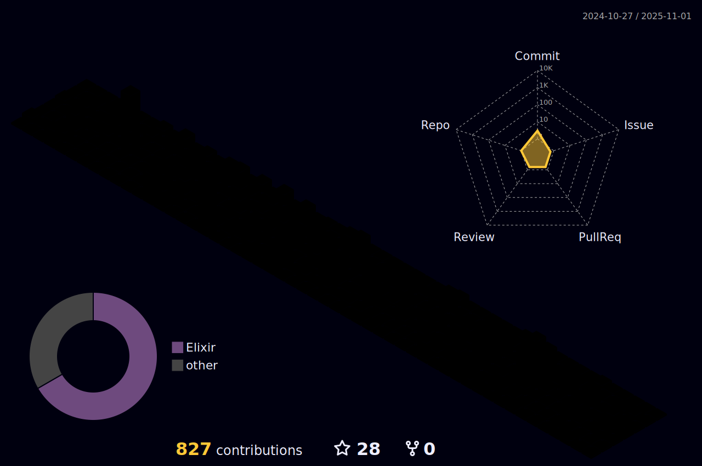

<!--  -->
  

 
  <code></code>
  <code></code>
  <code></code>
  <code></code>
  <code></code>
  <code></code>
  <code></code>
  <code></code>
  <code></code>
  <code></code>
  <code></code>

 
 

# Hello 👋

I'm a PHP developer with broad understanding skills for creating new applications, refactoring projects, migrating from SOAP to REST. I have solid experience in Laravel and I'm always looking for continuous learning in other areas of software development. My skills include:

- Development of web applications and RESTful API in PHP;

- Refactoring legacy projects to improve maintainability and scalability;

- Experience in migration from SOAP to REST;

- Domain Laravel framework and its components, such as Eloquent ORM, Blade Templates, and migrations;

- Management of software development projects, including collaboration with interdisciplinary teams;

- Continuous learning in other areas of software development, such as DevOps, Front and others;

- Knowledge in SQL database and data modeling;

- Skill in code versioning with Git and continuous integration with CI/CD;

I'm always looking for new challenges and opportunities to apply my skills and knowledge to provide high quality solutions to business needs.
   

  

  

  
  

 |  |  |  
 | ----------- | ----------- |

 

  

  
 
   
 
 
 

 
  
  

  

<!--  

    
   

 
 
 -->
